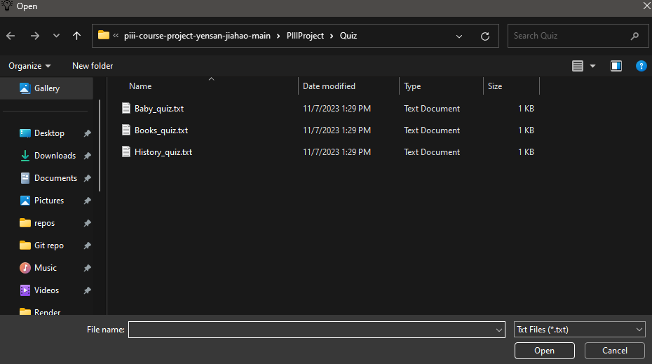
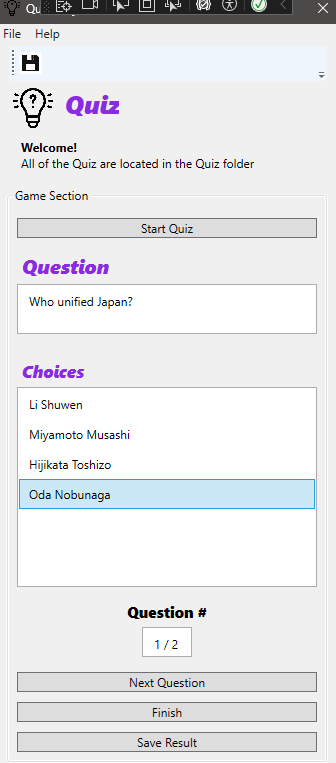
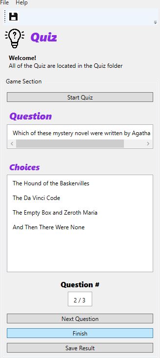
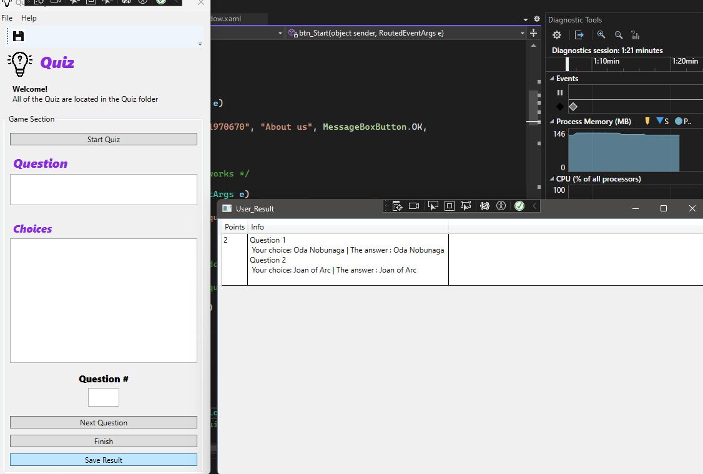

# Quiz Maker - README

## Menu

- [Introduction](#introduction)
- [Features](#features)
- [Getting Started](#getting-started)

## Introduction

Quiz Maker is a simple program designed to allow users to create and play quizzes using text files that contain questions and answers.
This utility is  way to test your knowledge or share quizzes with others. 
 
This is also the first application to be made in wpf as a team

## Features

### 1. Create and Play Quizzes

Quiz Maker allows you to create and play quizzes effortlessly. Simply provide a text file that contains questions and answers, and you're ready to challenge yourself or others with a fun quiz.

### 2. Choose a Quiz File

When starting the game, you'll have the option to choose a quiz file. This file should be formatted with questions and answers. Select the quiz file you want to play, and Quiz Maker will use it to generate your quiz questions.

### 3. Answer Questions

Once you've selected a quiz file, Quiz Maker will present questions for you to answer. Choose the correct option and click "Next" to proceed to the next question. Test your knowledge and see how well you can score!

### 4. Early Quiz Finish

If you wish to end the quiz before completing all the questions, you have the option to click the "Finish" button. Quiz Maker will calculate your score based on the answered questions, and you'll receive your results.

### 5. Save Your Results

After completing the quiz, Quiz Maker gives you the option to save your results. This is a great way to keep a record of your performance or to share your score with others. Your results will be saved in a file for future reference.

## Getting Started

To get started with Quiz Maker, follow these steps:

1. Launch the program and select the option to start a quiz.

2. Choose a quiz file (a text file containing questions and answers) to play.

3. Answer the questions presented to you by selecting the correct option and clicking "Next."

4. If you wish to end the quiz early, click the "Finish" button.

5. After completing the quiz, you have the option to save your results for future reference.
